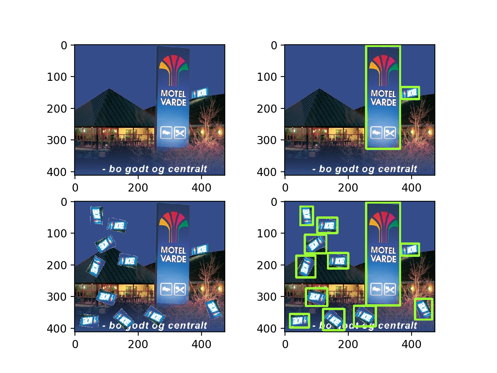
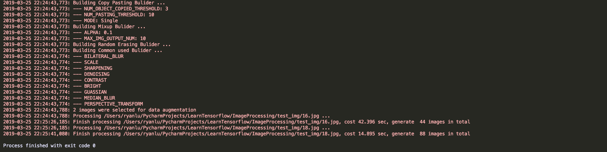

## Introduction:

Image processing is project we used for preprocessing image and data augmentation. We provide four methods to achieve this goal, including both input image and annotation.

1. Image preprocessing: provide 15 different preprocessing methods to generate 26 output images, including Gaussian blur, Rotation, Sharpening, Histogram equilization, Flipping, Brightness, Constract, Hue, Saturation, Adjust gamma, Scaling, Denoising, Median blur, Bilateral blur.

2. Annotation augmentation: Utilizing preprocessing methods—rescaling, flipping and rotating, on both original image and annotation. 

3.  Image copy-pasting: Data augmentation for small objects in original images.

4. Mix-up: visually coherent image mix-up for object detection

5. Random erasing: 

 

## Image copy-pasting 

#### Small object definition:

We define the small object in original image as those whose size is less than 1.23% of the total image size.

#### Copy-pasting strategy:

For each small object, we create three copies of it. 

- Step1: Rotate it with a random angle 

- Step2: Pick a random place to paste it. 

- Step3: Check whether the pasted object overlaps with any existed objects in the image. If there is any overlap, we define this copy failed and repeat the above steps again (From Step1 – Step3). We will try up to ten times until it succeed.

 

## Mix-up

We have two images as input. Set weights to both images and mix them into output image.

- Reference: [Mixup method][https://arxiv.org/abs/1710.09412]

 

## Random erasing

It is a new data augmentation method for training the CNN. In training,  Random erasing randomly selects a rectangle region in an image and erases its pixels with random values.

- Reference: [Augmentation for small object detection][https://arxiv.org/pdf/1902.07296.pdf]


## Requirement

- Python: 3.6
- Tensorflow: >1.8

 

## Structure

We split our code into **six** python scripts with a file containing parameters of image preprocessing methods:

- main.py: main process to handle the image data
- Image_builder.py: containing ImageData, AnnotationData and Builder object 

- preprocessing.py: containing bunch of image preprocessing methods

- copy_pasting.py: copy pasting algorithm

- mixup.py: two image mix up algorithm

- random_erasing.py: random erasing algorithm

##### Configuration

- config.json: parameters of image preprocessing methods
- configuration_generator.py: generate configuration 

##### Input folders:

- annotations: store input annotation json files

- test_img: store input image

##### Output folders:

- enhance_ann: store output images

- enhance_data: store output annotation json files

 

## Task 1: Image preprocessing without annnotations

**Here is the input you type in terminal:** 

```
python main.py \
--data_path=’YOUR PATH’ \
--enhance_data_path=”YOUR PATH” \
--config_path=”YOUR PATH” \
--pre_processing=True
```

You should see outputs like this: 

In the folder of enhance_data_path, you get output images as following: 

```
enhance_data_path
	|--- 1.jpg
	|--- 1_brightness.jpg 
	|--- 1_rotation45degree.jpg 
	|--- 1_flip_horizaltal.jpg 
	|-- ….

```


## Task 2: Image preprocessing with annnotations

Here is the input you type in terminal:

```
python main.py \
--data_path=’YOUR PATH’
--enhance_data_path=”YOUR PATH” \
--ann_path=”YOUR PATH” \
--enhance_ann_path=”YOUR PATH” \
--config_path=”YOUR PATH” \
--pre_processing=True
```


You should see outputs as following, results appear in two files: enhance_data_path (which puts the result images)and enhance_ann_path (which puts result annotations). 

```
enhance_data_path
	|--- 1.jpg 
	|--- 1_brightness.jpg 
	|--- 1_rotation45degree.jpg 
	|--- 1_flip_horizaltal.jpg 
	|-- …. 

enhance_ann_path
	|--- 1.json 
	|--- 1_brightness.json 
	|--- 1_rotation45degree.json 
	|--- 1_flip_horizaltal.json 
	|-- ….
```

 

## Task 3: Copy pasting algorithm only

Here is the input you type in terminal:

```
python main.py \
--data_path=’YOUR PATH’ \
--enhance_data_path=”YOUR PATH” \
--ann_path=”YOUR PATH” \
--enhance_ann_path=”YOUR PATH” \
--copy_pasting=True \
--copy_pasting_number=1
```

You should see outputs as following, results appear in two files: enhance_data_path (which puts the result images) and enhance_ann_path (which puts result annotations).



 

## Task 4: Mix-up

Here is the input you type in terminal:

```
python main.py \
--data_path=’YOUR PATH’ \
--enhance_data_path=”YOUR PATH” \
--ann_path=”YOUR PATH” \
--enhance_ann_path=”YOUR PATH” \
--mix_up =True
```

You should see outputs as following, results appears in two files: enhance_data_path (which puts the result images) and enhance_ann_path (which puts result annotations).

 

## Task 5: Random erasing

Here is the input you type in terminal:

```
python main.py \
--data_path=’YOUR PATH’ \
--enhance_data_path=”YOUR PATH” \
--ann_path=”YOUR PATH” \
--enhance_ann_path=”YOUR PATH” \
--random_erasing=True
```

You should see outputs as following, results appears in two files: enhance_data_path (which puts the result images) and enhance_ann_path (which puts result annotations).

```
enhance_data_path 
	|--- 1.jpg 
	|--- 1_random_erasing.jpg 

enhance_ann_path 
	|--- 1.json 
	|--- 1_random_erasing.json

```


## Version 6: FULL POWER(not finish)

```
python main.py \
--data_path=’YOUR PATH’ \
--enhance_data_path=”YOUR PATH”\
--ann_path=”YOUR PATH” \
--enhance_ann_path=”YOUR PATH” \
--copy_pasting=True \
--config_path=”YOUR PATH” \
--pre_processing=True
```


##### Output:

```
enhance_data_path
	|--- 1.jpg 
	|--- 1_copy_pasting.jpg 
	|--- 1_brightness.jpg 
	|--- 1_rotation45degree.jpg 
	|--- 1_flip_horizaltal.jpg 
	|-- ….

enhance_ann_path 
	|--- 1.json 
	|--- 1_copy_pasting.json 
	|--- 1_brightness.json 
	|--- 1_rotation45degree.json 
	|--- 1_flip_horizaltal.json 
	|-- ….

```


